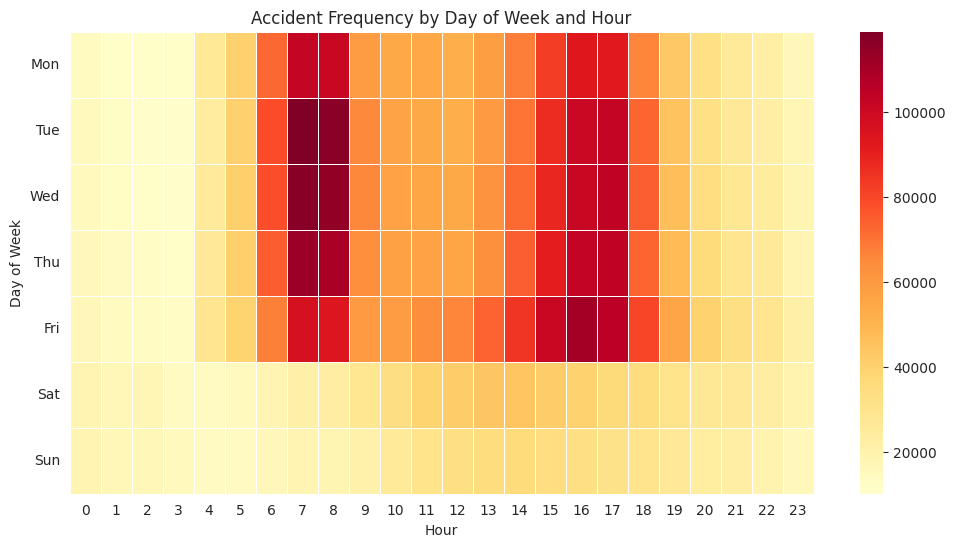
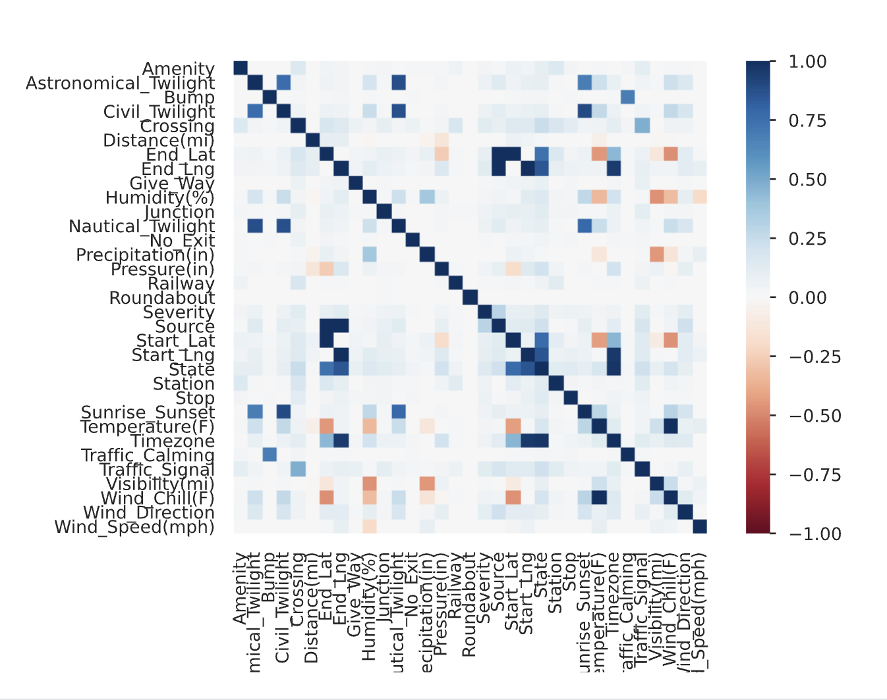

# Exploring Road Safety: A Deep Dive into the US Accidents Dataset

## 📊 Project Overview

This project presents a comprehensive analysis of the US Accidents dataset, exploring patterns, trends, and insights related to traffic accidents across the United States. The analysis covers a 6-year period and provides valuable insights into road safety factors, temporal patterns, and geographical distributions.

## 🎯 Key Objectives

- Analyze accident patterns across different time periods and locations
- Identify high-risk areas and contributing factors
- Explore temporal trends in accident occurrences
- Understand the relationship between various traffic features and accident frequency
- Provide actionable insights for road safety improvements

## 📈 Dataset Information

**Source**: [US Accidents Dataset](https://www.kaggle.com/datasets/sobhanmoosavi/us-accidents) by Sobhan Moosavi  
**Time Period**: 6 years of accident data  
**Features**: 46 variables including location, weather, traffic conditions, and accident details  
**Size**: Comprehensive dataset with 7million+ of accident records

## 🔍 Analysis Methodology

### Data Exploration
- **Data Profiling**: Comprehensive analysis using pandas-profiling for initial data understanding
- **Missing Value Analysis**: Identification and handling of missing data
- **Correlation Analysis**: Exploration of relationships between variables
- **Statistical Analysis**: Distribution analysis and summary statistics

### Visualization Techniques
- **Geographical Analysis**: Mapping accident hotspots and regional patterns
- **Temporal Analysis**: Time-based visualizations for accident trends
- **Statistical Plots**: Histograms, distribution plots, and correlation heatmaps
- **Interactive Visualizations**: Dynamic charts for better data exploration
- **Correlation Analysis**: Heatmaps showing relationships between features
- **Time Series Analysis**: Hourly and daily accident pattern visualizations

## 📊 Key Findings

### 🏙️ Geographical Distribution
- **High-Risk Cities**: Less than 4.5% of cities (494 cities) had more than 1,000 accidents
- **Low-Risk Areas**: More than 4,400 cities had less than 10 accidents over the 6-year period
- **Regional Patterns**: Accidents were more frequent in coastal areas, with central regions showing lower accident rates
- **Notable Absence**: New York City data was not present in the dataset

### ⏰ Temporal Patterns

#### Weekday Accidents
- **Peak Hours**: Most accidents occurred during 6 AM to 9 AM and 3 PM to 6 PM
- **Commute Correlation**: Peak times align with typical office and home commute periods
- **Pattern**: Clear bimodal distribution reflecting rush hour traffic

#### Weekend Accidents
- **Different Pattern**: Bell curve distribution with peak between 10 AM to 3 PM
- **Leisure Time**: Accidents concentrated during typical leisure and shopping hours
- **Opposite Trend**: Weekend patterns differ significantly from weekday patterns

### 📈 Visual Analysis

#### Accident Patterns by Hour


*This visualization shows the distribution of accidents across different hours of the day, revealing clear patterns in accident timing. The analysis demonstrates distinct peaks during rush hour periods and different patterns for weekdays versus weekends.*

#### Feature Correlations


*This correlation heatmap reveals the relationships between different traffic and environmental features in the dataset. It helps identify which factors are most strongly associated with accident occurrences and provides insights for predictive modeling.*

### 🚦 Traffic Features Analysis
- **Traffic Signals**: Strong correlation with accident frequency
- **Traffic Calming**: High correlation with accident occurrences
- **Weather Conditions**: Temperature and wind chill show significant correlations
- **Road Features**: Various road infrastructure elements impact accident rates

### 📈 Statistical Insights
- **Data Quality**: Comprehensive dataset with 46 variables for detailed analysis
- **Correlation Patterns**: Multiple high correlations identified between traffic features
- **Imbalanced Data**: Some features show significant imbalances requiring careful interpretation
- **Missing Data**: Strategic handling of missing values for robust analysis

## 🛠️ Technical Implementation

### Libraries Used
- **Data Analysis**: pandas, numpy
- **Visualization**: matplotlib, seaborn
- **Data Profiling**: pandas-profiling
- **Data Loading**: kagglehub

### Analysis Workflow
1. **Data Loading**: Direct access to Kaggle dataset
2. **Initial Exploration**: Comprehensive data profiling
3. **Feature Analysis**: Correlation and distribution analysis
4. **Temporal Analysis**: Time-based pattern identification
5. **Geographical Analysis**: Location-based insights
6. **Statistical Modeling**: Advanced statistical techniques

## 📋 Key Insights Summary

### 🎯 Primary Findings
1. **Commute Impact**: Rush hour traffic significantly increases accident risk
2. **Geographical Hotspots**: Coastal areas show higher accident rates
3. **Infrastructure Correlation**: Traffic signals and calming measures correlate with accidents
4. **Weather Influence**: Temperature and wind conditions affect accident patterns
5. **Urban vs Rural**: Clear distinction in accident patterns between different city sizes

### 🚨 Safety Implications
- **Peak Hours**: Need for enhanced safety measures during commute times
- **High-Risk Areas**: Focus on infrastructure improvements in identified hotspots
- **Weather Awareness**: Better weather-related safety protocols
- **Infrastructure**: Strategic placement of traffic calming measures

## 📁 Project Structure

```
Exploring-Road-Safety-A-Deep-Dive-into-the-US-Accidents-Dataset/
├── Analysis_file.ipynb          # Main analysis notebook
└── README.md                    # Project documentation
```

## 🚀 Getting Started

### Prerequisites
- Python 3.7+
- Jupyter Notebook
- Required libraries: pandas, numpy, matplotlib, seaborn, kagglehub

### Installation
```bash
pip install pandas numpy matplotlib seaborn kagglehub
```

### Running the Analysis
1. Open `Analysis_file.ipynb` in Jupyter Notebook
2. Ensure you have access to the Kaggle dataset
3. Run all cells to reproduce the analysis

## 📊 Data Sources

- **Primary Dataset**: US Accidents Dataset from Kaggle
- **Data Provider**: Sobhan Moosavi
- **Coverage**: United States traffic accidents
- **Time Span**: 6 years of comprehensive accident data

## 🤝 Contributing

This project is open for contributions and improvements. Feel free to:
- Suggest additional analysis approaches
- Improve visualizations
- Add new insights or findings
- Enhance documentation

## 📄 License

This project is for educational and research purposes. Please ensure proper attribution when using the analysis or insights.

## 📞 Contact

For questions or collaboration opportunities, please reach out through the project repository.

---

*This analysis provides valuable insights into road safety patterns and can inform policy decisions, infrastructure improvements, and public safety initiatives across the United States.* 